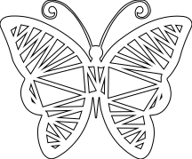
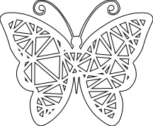
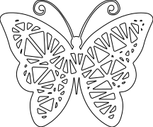
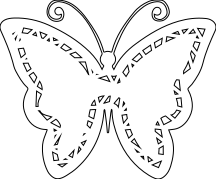
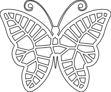
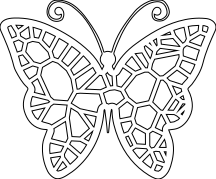
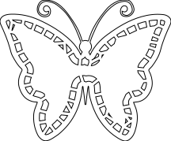
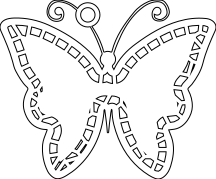
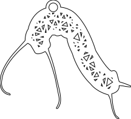

# Overview
A tool for taking in an SVG and making it more interesting to plot or cut with the magic of voronois and delaunay triangulation.

Takes the longest path found in an SVG and fills it with parametric joy.

I guess somewhat inspried by trammel's [lace maker](https://bitbucket.org/hudson/boxer/src/tip/lace-maker?at=default)

And very inspired by Julien Leonard's [paper cut butterflies](https://julienleonard.com/making-of-paper-cut-butterfly.html)

# Usage
Requires a pretty recent version of node, I use 
     
     nvm use v12.7.0

Command line options mostly make sense

    [blackmad@wnyc plottrbottr (master)]$ node lace-maker2.js --help
    usage: lace-maker2.js [-h] [--debug] [--inchInPoints INCHINPOINTS] [--addHole]
                          [--butt] [--holeSize HOLESIZE] [--maxWidth MAXWIDTH]
                          [--maxHeight MAXHEIGHT] [--voronoi] [--subtract]
                          [--numPoints NUMPOINTS]
                          [--numExtraPoints NUMEXTRAPOINTS] [--open]
                          [--outputTemplate OUTPUTTEMPLATE]
                          [--subtractBuffer SUBTRACTBUFFER]
                          [--outlineSize OUTLINESIZE] [--safeBorder SAFEBORDER]
                          [--rounded]
                          inputFile [inputFile ...]

    Positional arguments:
      inputFile

    Optional arguments:
      -h, --help            Show this help message and exit.
      --debug               output debugging in console and svg output
      --inchInPoints INCHINPOINTS
                            an inch in points, some people say 96, illustrator 
                            says 72
      --addHole             add a hole to the output for putting a cord or 
                            jumpring through
      --butt                if shape is wider than it is long, puts hole at long 
                            end rather than middle of width, only meaningful with 
                            --addHole
      --holeSize HOLESIZE   --addHole size in inches
      --maxWidth MAXWIDTH   maximum width (in inches) to resize width of input 
                            svg to
      --maxHeight MAXHEIGHT
                            maximum height (in inches) to resize height of input 
                            svg to
      --voronoi             if false, fills with delaunay triangles, if true, 
                            with voronoi diagram
      --subtract            subtracts a shrunk copy of the outline from the inner 
                            lace
      --numPoints NUMPOINTS
                            number of points to sample along outline for 
                            triangulation
      --numExtraPoints NUMEXTRAPOINTS
                            number of extra random interior points to add to 
                            triangulation
      --open                open resulting svg in google chrome
      --outputTemplate OUTPUTTEMPLATE
                            template for outputting final svg. {{basePath}} is 
                            the only interpolated variable - original filename 
                            without extension
      --subtractBuffer SUBTRACTBUFFER
                            (in inches) how much to shrink outline by to create 
                            inner shape
      --outlineSize OUTLINESIZE
                            (in inches) half of border width between inner cutouts
      --safeBorder SAFEBORDER
                            (in inches) width of border around the inner design
      --rounded             rounds corners of triangles/voronois

# Examples
    ## Triangles with 0 extra points
    node lace-maker2.js examples/input/butterfly.svg --outputTemplate 'examples/output-svg/triangles-0.svg' --numExtraPoints 0
important bits:

    --numExtraPoints 0

## Triangles with 10 extra points
    node lace-maker2.js examples/input/butterfly.svg --outputTemplate 'examples/output-svg/triangles-10.svg' --numExtraPoints 10
important bits:

    --numExtraPoints 10

## Triangles with 10 extra points + rounding
    node lace-maker2.js examples/input/butterfly.svg --outputTemplate 'examples/output-svg/triangles-rounded-10.svg' --rounded --numExtraPoints 10
important bits:

    --rounded --numExtraPoints 10

## Triangles with 10 extra points + inner-subtract
    node lace-maker2.js examples/input/butterfly.svg --outputTemplate 'examples/output-svg/triangles-subtract-10.svg' --subtract --numExtraPoints 10
important bits:

    --subtract --numExtraPoints 10

## Voronoi with 0 extra points
    node lace-maker2.js examples/input/butterfly.svg --outputTemplate 'examples/output-svg/voronoi-0.svg' --voronoi --numExtraPoints 0
important bits:

    --voronoi --numExtraPoints 0

## Voronoi with 10 extra points
    node lace-maker2.js examples/input/butterfly.svg --outputTemplate 'examples/output-svg/voronoi-10.svg' --voronoi  --numExtraPoints 10
important bits:

    --voronoi  --numExtraPoints 10

## Voronoi with 10 extra points + rounded
    node lace-maker2.js examples/input/butterfly.svg --outputTemplate 'examples/output-svg/voronoi-rounded-10.svg' --rounded --voronoi  --numExtraPoints 10
important bits:

    --rounded --voronoi  --numExtraPoints 10

## Voronoi with 10 extra points + inner subtract
    node lace-maker2.js examples/input/butterfly.svg --outputTemplate 'examples/output-svg/voronoi-subtract-10.svg' --voronoi --subtract --numExtraPoints 10
important bits:

    --voronoi --subtract --numExtraPoints 10

## Voronoi with 10 extra points + inner subtract + see debugging
    node lace-maker2.js examples/input/butterfly.svg --outputTemplate 'examples/output-svg/voronoi-subtract-debug-10.svg' --voronoi --subtract --debug --numExtraPoints 10
important bits:

    --voronoi --subtract --debug --numExtraPoints 10

## Voronoi with 10 extra points + inner subtract + add pendant hole
    node lace-maker2.js examples/input/butterfly.svg --outputTemplate 'examples/output-svg/voronoi-subtract-hole-10.svg' --addHole --voronoi --subtract --numExtraPoints 10
important bits:

    --addHole --voronoi --subtract --numExtraPoints 10

## Triangular caterpillar with center hole
    node lace-maker2.js examples/input/caterpillar.svg --outputTemplate 'examples/output-svg/caterpillar-hole.svg' --addHole
important bits:

    --addHole

